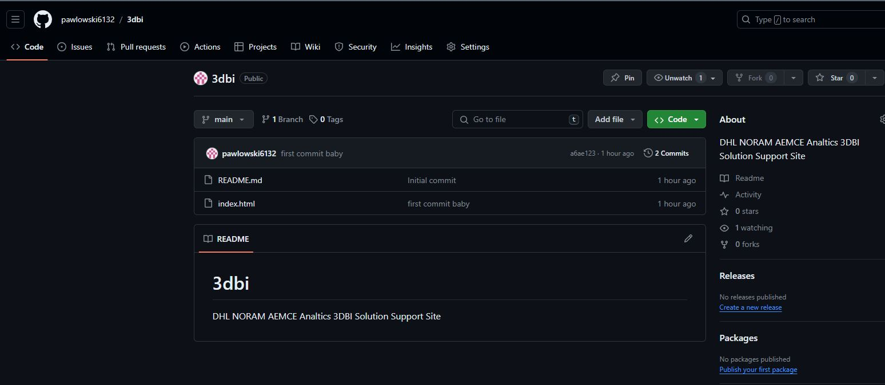
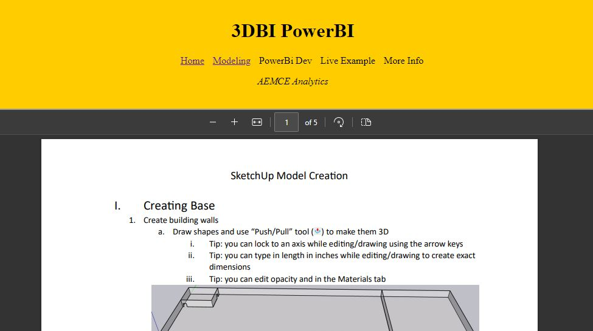
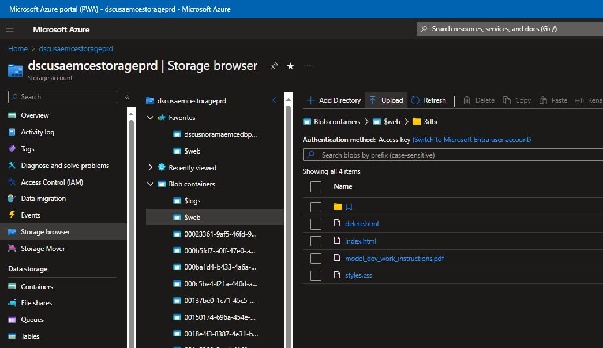
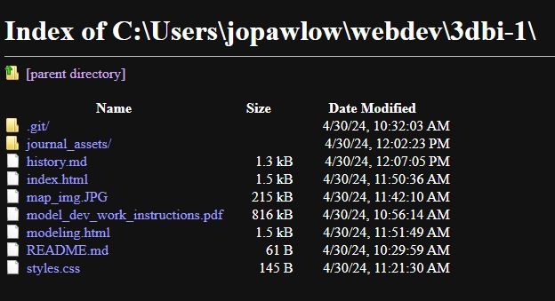

# Development Journal

## 4/30/24
Decided to present all 3DBI development support in a webpage hosted in DHL/AEMCE Azure Blob Storage and displayed in AEMCE Analystics Teams site. It will have live links to working reports, 3D model dev work instructions, mgt background, licensing, sample project plans etc.

1. Created Github repository in pawlowski6132 personal github account
   


2. Messed around CSS and decided a simple design and layout witih a header at the top will work best. Also figured out that, using iframes, I can easily embed a PDF file which I will use for the modeling work instructions and the More Info mgt summary document



3. Tested loading all files into AEMCE storage account to ensure I had upload access and ability to edit. I created a sub-directory called '3dbi' where I will host this site.



4. Here is the URL for the index page in the storage account:

```
https://dscusaemcestorageprd.z13.web.core.windows.net/3dbi/index.html
```
5. I tested the ability to commit my code to the repo and sync and it works.

6. Locally files are stored on my laptop only.



----------------------------------

Next I need to layout all the pages, finish the documents, convert to PDF, upload etc.


